# AssiHarness

> AI 에이전트들의 지휘자 — GitHub Issue를 넣으면, AI가 알아서 코드를 작성합니다.

AssiHarness는 **설정 기반 범용 에이전트 오케스트레이션 엔진**입니다. 사람이 GitHub Issue를 작성하면, AI 에이전트가 자동으로 코드를 작성하고, 검토하고, 테스트합니다.

## 한눈에 보는 AssiHarness

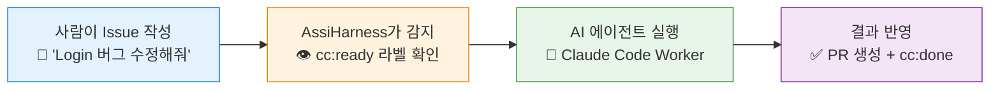

## 비유로 이해하기

### 공장의 자동화 라인

AssiHarness를 **공장**이라고 생각해보세요:

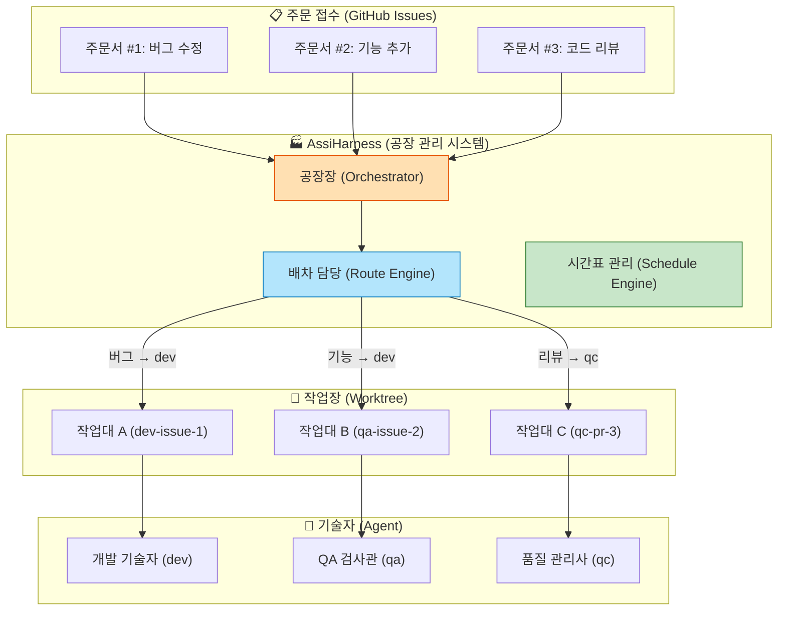

| 공장 비유 | AssiHarness | 설명 |
|-----------|-------------|------|
| 주문서 | GitHub Issue | 해야 할 작업이 적힌 문서 |
| 공장장 | Orchestrator | 전체를 지휘하는 메인 루프 |
| 배차 담당 | Route Engine | 어떤 기술자에게 보낼지 결정 |
| 기술자 | Agent (dev, qa, qc) | 실제 작업을 수행하는 AI |
| 작업대 | Git Worktree | 기술자마다 독립된 작업 공간 |
| 완료 보고서 | PR + Comment | 결과물과 작업 보고 |
| 시간표 | Schedule Engine | 정기 점검, 자동 수집 등 예약 작업 |
| 안전 관리자 | Recovery Engine | 멈춘 기계 재가동, 청소 |

### 식당의 주방

또 다른 비유로, **식당 주방**을 생각해볼 수 있습니다:

- **손님의 주문** = GitHub Issue
- **주방장** = Orchestrator (전체 조율)
- **주문표** = 라벨 (cc:ready → cc:running → cc:done)
- **요리사들** = Agent (파스타 담당, 디저트 담당...)
- **각자의 조리대** = Worktree (서로의 요리에 영향 없음)
- **요리 완성** = PR 생성 + 코멘트

## 핵심 철학

### 1. Agent-Agnostic (에이전트 무관)

AssiHarness의 코어 코드에는 "dev", "qa", "qc" 같은 특정 에이전트 이름이 **전혀 등장하지 않습니다.** 에이전트가 1개든 100개든 동일한 프로그램으로 구동됩니다.

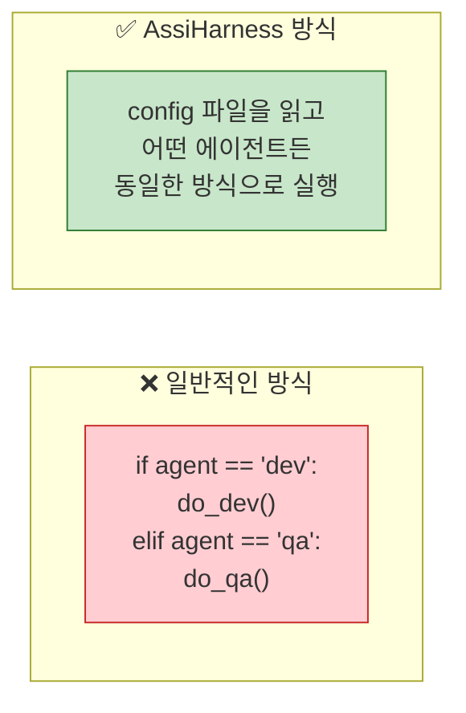

### 2. Config-Driven (설정 중심)

모든 행동 차이는 **YAML 설정 파일**에서 정의됩니다. 새 에이전트 추가 시 코드 수정이 전혀 필요 없습니다.

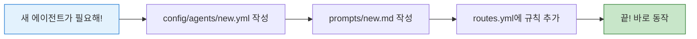

### 3. GitHub = State Store (상태 저장소)

별도의 데이터베이스(Redis, SQLite)가 필요 없습니다. **GitHub의 라벨과 Issue 자체가 상태 저장소**입니다.

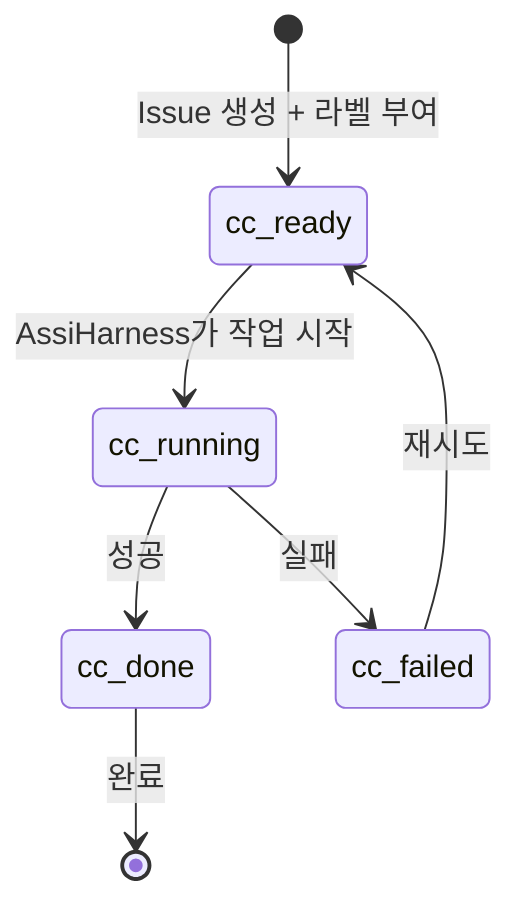

### 4. Worktree 격리

모든 Worker는 **독립된 Git worktree**에서 실행됩니다. 마치 여러 사람이 같은 프로젝트의 복사본을 각자 갖고 작업하는 것과 같습니다.

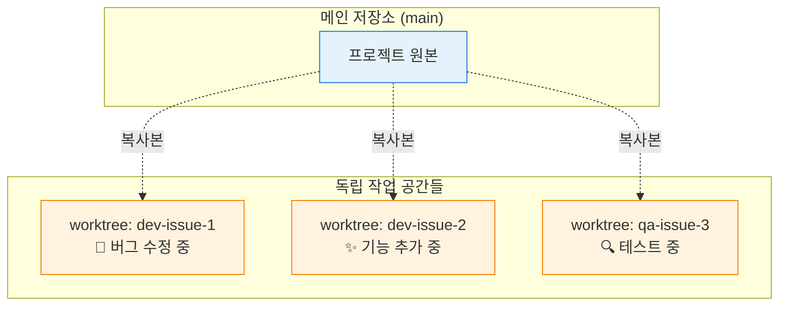

## 시스템 구성도

### 전체 아키텍처

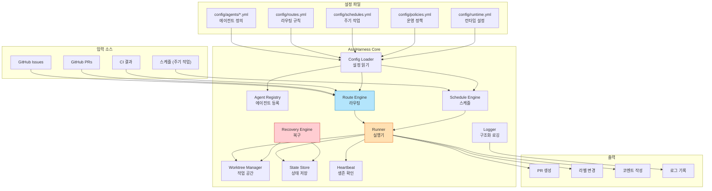

### 메인 실행 루프

AssiHarness는 **30초마다** 아래 과정을 반복합니다:

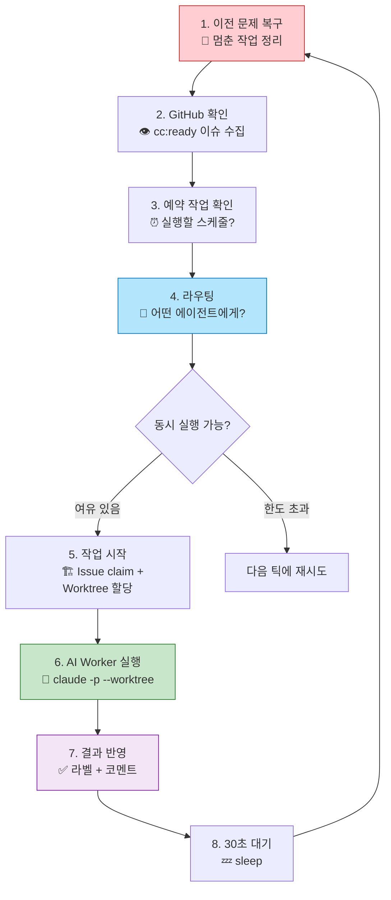

### Issue 생명주기

하나의 Issue가 어떤 여정을 거치는지 보여줍니다:

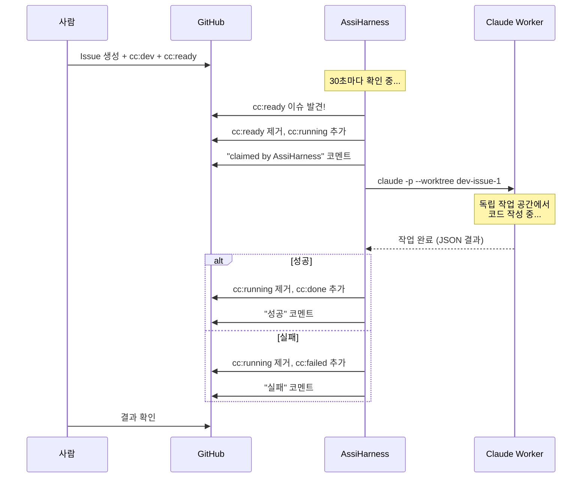

### 멀티 에이전트 협업 루프

여러 에이전트가 협업하는 고급 시나리오입니다:

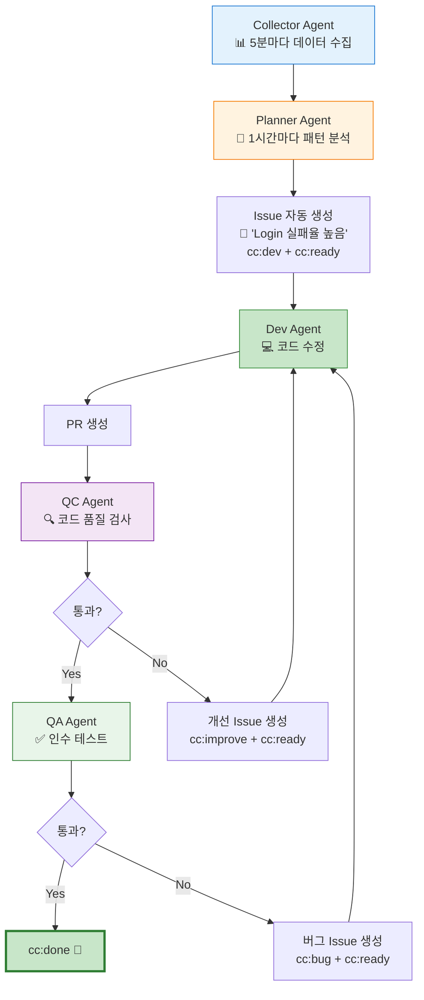

## 라벨 시스템

AssiHarness는 GitHub 라벨을 **신호등**처럼 사용합니다:

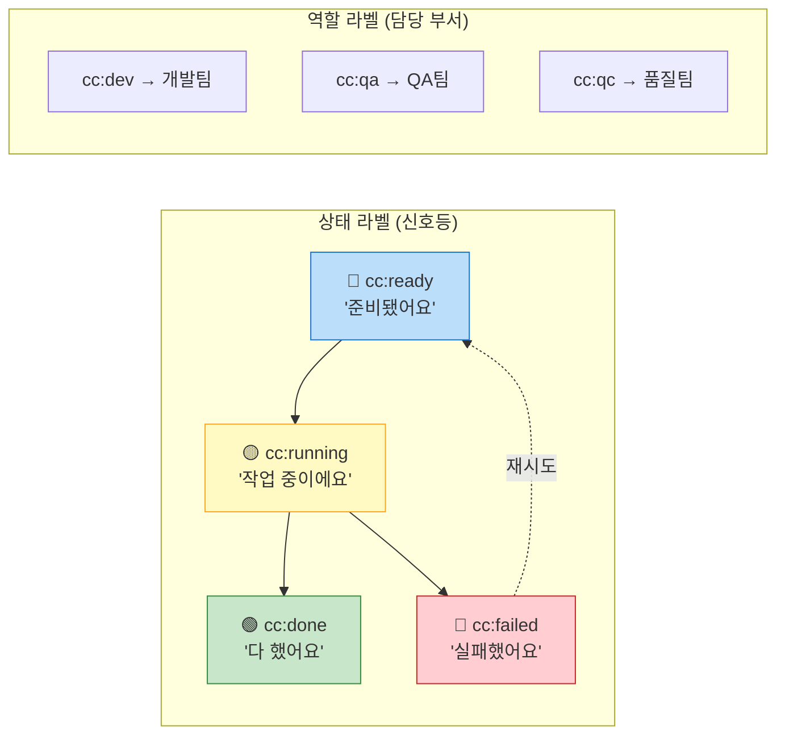

## 사전 요구사항

시작하기 전에 아래 3가지가 필요합니다:

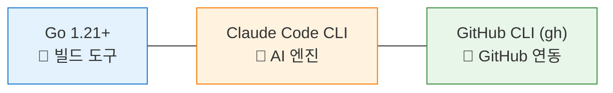

### 1. Go 설치 (1.21 이상)

Go는 AssiHarness를 빌드하는 데 필요합니다.

```bash
# macOS (Homebrew)
brew install go

# 설치 확인
go version
# 출력 예: go version go1.26.0 darwin/arm64
```

> Windows: https://go.dev/dl/ 에서 설치 파일을 다운로드하세요.

### 2. Claude Code CLI 설치

Claude Code는 실제 코드를 작성하는 AI 엔진입니다.

```bash
# npm으로 설치 (Node.js가 필요합니다)
npm install -g @anthropic-ai/claude-code

# 설치 확인
claude --version
```

> Node.js가 없다면: `brew install node` (macOS) 또는 https://nodejs.org/ 에서 설치

### 3. GitHub CLI (gh) 설치 및 인증

gh는 AssiHarness가 GitHub과 통신하는 데 사용합니다.

```bash
# macOS (Homebrew)
brew install gh

# GitHub 로그인 (처음 한 번만)
gh auth login
# → "GitHub.com" 선택
# → "HTTPS" 선택
# → "Login with a web browser" 선택
# → 브라우저에서 인증 완료

# 인증 확인
gh auth status
# ✓ Logged in to github.com 이 나오면 성공!
```

## 빠른 시작 (Quick Start)

### Step 1: 저장소 클론 및 빌드

```bash
# 저장소 다운로드
git clone https://github.com/tykimos/assiharness.git

# 폴더 이동
cd assiharness

# 빌드 (실행 파일 생성)
make build

# 잘 만들어졌는지 확인
./assiharness --help
```

아래와 같이 나오면 성공입니다:

```
Usage of ./assiharness:
  -config string
        path to config directory (default "config")
  -dry-run
        print routing results without executing
  -once
        run single iteration and exit
```

### Step 2: GitHub 저장소 설정

`config/runtime.yml` 파일을 열고, 자신의 GitHub 정보를 입력합니다:

```yaml
# config/runtime.yml
poll_interval: 30s        # 30초마다 GitHub 확인
log_level: info
state_dir: state
logs_dir: logs

github:
  api_url: https://api.github.com
  owner: 자신의_GitHub_아이디    # ← 여기를 변경하세요!
  repo: 자신의_저장소_이름       # ← 여기를 변경하세요!

claude:
  binary: claude
  default_output_format: json
  default_verbose: false
```

### Step 3: GitHub 라벨 생성

AssiHarness가 사용할 라벨을 GitHub에 만듭니다. 터미널에서 아래 명령어를 하나씩 실행하세요:

```bash
# 상태 라벨 (필수)
gh label create "cc:ready"   --color "1D76DB" --description "Ready for processing"
gh label create "cc:running" --color "FBCA04" --description "Currently processing"
gh label create "cc:done"    --color "0E8A16" --description "Completed"
gh label create "cc:failed"  --color "D93F0B" --description "Failed"

# 역할 라벨 (에이전트 라우팅용)
gh label create "cc:dev"     --color "0E8A16" --description "Development task"
```

### Step 4: 리허설 (Dry-run)

실제로 AI를 실행하지 않고, 라우팅만 확인하는 **리허설 모드**입니다:

```bash
./assiharness --once --dry-run --config ./config
```

### Step 5: 실전 테스트

드디어 진짜로 실행해봅니다!

```bash
# 1. 테스트 이슈를 GitHub에 생성합니다
gh issue create \
  --title "Test: Add hello.txt file" \
  --body "Create a file named hello.txt with the content 'Hello from AssiHarness!'" \
  --label "cc:dev" --label "cc:ready"

# 2. AssiHarness를 한 번 실행합니다
./assiharness --once --config ./config
```

**무슨 일이 일어나나요?**

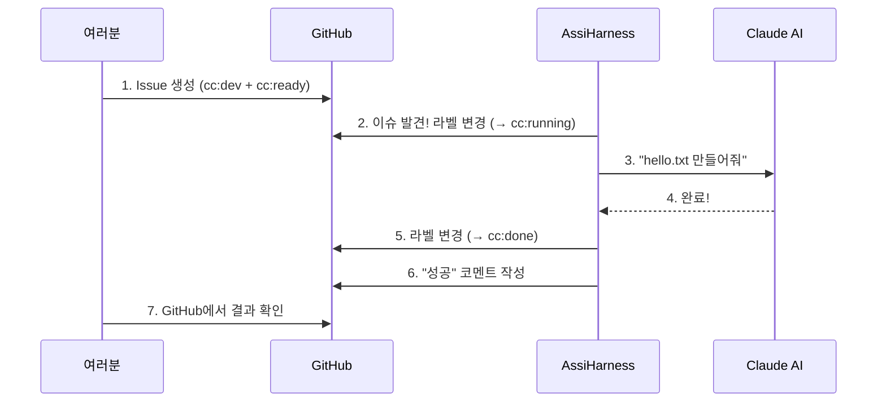

## 상시 실행하기

테스트가 성공했으면, 이제 AssiHarness를 **항상 켜놓고** 자동으로 일하게 할 수 있습니다.

### 방법 1: 포그라운드 실행 (가장 간단)

```bash
./assiharness --config ./config
# 30초마다 자동으로 GitHub을 확인합니다
# 종료하려면 Ctrl+C
```

### 방법 2: tmux로 백그라운드 실행 (추천)

터미널을 닫아도 계속 실행됩니다:

```bash
# 시작
tmux new-session -d -s assiharness './assiharness --config ./config'

# 로그 보기 (언제든 확인 가능)
tmux attach -t assiharness

# 로그 보기를 멈추려면: Ctrl+B 누른 후 D
```

## 설정 가이드

### 새 에이전트 추가하기

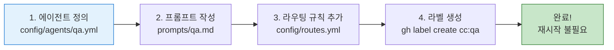

#### 1단계: 에이전트 정의 파일 생성

`config/agents/qa.yml` 파일을 만듭니다:

```yaml
id: qa                         # 이 에이전트의 이름
type: claude_worker             # AI로 실행
enabled: true                   # 활성화

prompt_file: prompts/qa.md      # 이 에이전트의 성격/역할
allowed_tools:                  # 사용할 수 있는 도구
  - Read                        # 파일 읽기
  - Bash                        # 명령어 실행
  - Grep                        # 코드 검색

worktree:
  mode: per_task                # 작업마다 독립 공간
  pattern: "{agent_id}-{task_id}"

concurrency:
  max_parallel: 2               # 최대 2개 동시 작업

timeouts:
  execution: 15m                # 15분 안에 끝내야 함

retries:
  max_attempts: 1               # 실패 시 1번 재시도
  backoff: 1m

outputs:
  on_success:
    add_labels: ["cc:done"]
    remove_labels: ["cc:running"]
  on_failure:
    add_labels: ["cc:failed"]
    remove_labels: ["cc:running"]
```

#### 2단계: 프롬프트 파일 작성

`prompts/qa.md` 파일을 만듭니다:

```markdown
You are a QA agent. Review the code changes and verify they meet the acceptance criteria.
Run tests and report any failures.
```

#### 3단계: 라우팅 규칙 추가

`config/routes.yml`에 새 규칙을 추가합니다:

```yaml
routes:
  - id: issue_to_dev
    when:
      source: github_issue
      labels: ["cc:dev", "cc:ready"]
    dispatch:
      agent: dev
    priority: 10

  - id: issue_to_qa              # ← 이 부분을 추가
    when:
      source: github_issue
      labels: ["cc:qa", "cc:ready"]
    dispatch:
      agent: qa
    priority: 20
```

#### 4단계: GitHub 라벨 생성

```bash
gh label create "cc:qa" --color "5319E7" --description "QA verification"
```

**바이너리 재빌드 없이** AssiHarness가 자동으로 새 설정을 감지합니다 (Config hot-reload).

### 설정 파일 구조

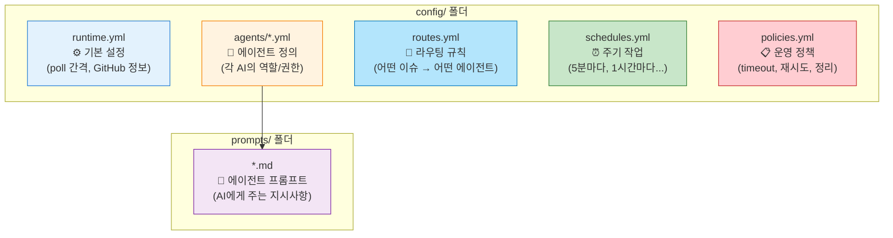

### 주기 작업 설정

`config/schedules.yml`에서 정기적으로 실행할 작업을 정의합니다:

```yaml
jobs:
  - id: collect_logs
    enabled: true
    every: 5m              # 5분마다 실행
    dispatch:
      agent: collector
      input:
        source: app_logs

  - id: daily_report
    enabled: true
    every: 24h             # 하루에 한 번
    dispatch:
      agent: reporter
```

### 운영 정책 설정

`config/policies.yml`에서 안전 장치를 설정합니다:

```yaml
lock:
  strategy: label_and_assignee
  bot_user: assiharness-bot

worktree:
  cleanup_after: 24h          # 24시간 후 정리
  max_total: 20               # 최대 20개 작업 공간

recovery:
  stale_running_timeout: 1h   # 1시간 넘게 돌면 비정상으로 판단
  max_consecutive_failures: 3  # 3번 연속 실패 시 알림
  orphan_check_interval: 30m

issue_creation:
  duplicate_check: true
  loop_prevention:
    max_issues_per_hour: 10   # 시간당 최대 10개 이슈 생성
    cooldown_on_limit: 30m
```

## 안전 장치

AssiHarness는 여러 안전 장치를 갖추고 있습니다:

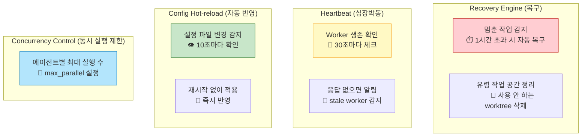

## 프로젝트 구조

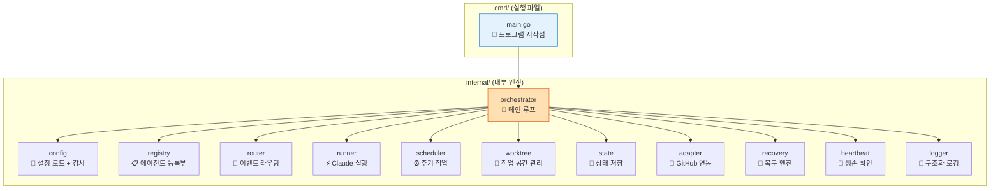

## CLI 옵션

| 옵션 | 설명 | 사용 예 |
|------|------|--------|
| `--config <경로>` | 설정 폴더 위치 (기본: config) | `./assiharness --config ./my-config` |
| `--once` | 1회 실행 후 종료 | `./assiharness --once` |
| `--dry-run` | 실행 없이 라우팅만 확인 | `./assiharness --dry-run` |

**조합 사용:**

```bash
# 가장 안전한 첫 테스트: 1회만, 실행 안 함
./assiharness --once --dry-run

# 1회 실제 실행
./assiharness --once

# 상시 실행 (30초마다 반복)
./assiharness
```

## 로그 읽는 법

AssiHarness는 JSON 형식의 구조화 로그를 출력합니다:

```json
{"time":"2026-03-23T02:25:39+09:00","level":"INFO","msg":"running worker","agent":"dev","task":"dev-1","worktree":"dev-dev-1"}
{"time":"2026-03-23T02:25:59+09:00","level":"INFO","msg":"worker succeeded","agent":"dev","task":"dev-1"}
```

| 필드 | 의미 |
|------|------|
| `time` | 발생 시각 |
| `level` | 중요도 (DEBUG < INFO < WARN < ERROR) |
| `msg` | 무슨 일이 일어났는지 |
| `agent` | 어떤 에이전트가 |
| `task` | 어떤 작업을 |

로그는 `logs/assiharness.log` 파일에도 저장됩니다.

## 빌드

```bash
# 현재 플랫폼용 빌드
make build

# 모든 플랫폼 빌드 (Linux, macOS, Windows)
make build-all

# 테스트 실행
make test

# 빌드 파일 정리
make clean
```

## 자주 묻는 질문 (FAQ)

**Q: AI가 잘못된 코드를 작성하면 어떻게 되나요?**

A: AssiHarness는 모든 작업을 독립된 worktree에서 실행하므로, 메인 코드에 영향을 주지 않습니다. 결과가 마음에 들지 않으면 무시하면 됩니다.

**Q: 동시에 여러 이슈를 처리할 수 있나요?**

A: 네! `concurrency.max_parallel` 설정으로 에이전트별 동시 실행 수를 조절할 수 있습니다.

**Q: 실행 중에 설정을 바꿔도 되나요?**

A: 네! Config hot-reload가 10초마다 설정 변경을 감지하고 자동으로 적용합니다. 재시작이 필요 없습니다.

**Q: AssiHarness가 갑자기 종료되면 어떻게 되나요?**

A: 다시 시작하면 Recovery Engine이 자동으로 이전 상태를 정리합니다. 멈춰있던 작업은 cc:failed로 표시되고, 고아 worktree는 정리됩니다.

## 라이선스

MIT License
